# SHOPPE

Modern e-commerce frontend application focused on real-world UI architecture, authentication flows, cart synchronization, and responsive user experience.

## LIVE DEMO

https://shoppe-8f1f.vercel.app/

---

# TEST ACCOUNTS

## Admin
email: admin@email.com  
password: Password1

## Customer
email: user@email.com  
password: Password1

---

# FEATURES

## Authentication & Authorization
- JWT-based authentication flow
- Role-based UI rendering
- Protected admin functionality
- Persistent authentication state
- Conditional rendering based on user role and authorization status

## Product Management
- Create/update/archive products
- Product image upload support
- Product filtering
- Search functionality
- Responsive product gallery

## Cart & Checkout
- Add/remove/update cart items
- Cart persistence across authentication states
- Guest cart synchronization after login/signup
- Checkout validation using Zod + React Hook Form
- Address and shipping information handling
- Order notes support

## Orders
- Order tracking by ID
- Order cancellation flow
- Downloadable receipts

## UI/UX
- Fully responsive design
- Mobile navigation
- Product sliders using Keen Slider
- Loading and error states
- Conditional UI for admin/customer flows

---

# TECH STACK

## Frontend
- React
- TypeScript
- Vite
- Tailwind CSS
- Redux Toolkit
- TanStack Query
- React Hook Form
- Zod
- Keen Slider
- MUI

## Services & Infrastructure
- Cloudinary (image hosting and management)
- Vercel (frontend deployment)

---

# ARCHITECTURE DECISIONS

## State Management

Redux Toolkit is used for:
- authentication state
- global UI state
- cart synchronization

TanStack Query handles:
- server state
- caching
- async request lifecycle
- refetching and invalidation

This separation helps avoid mixing client UI state with server state.

---

## Cart Synchronization

Guest users can add products to cart before authentication.

After login/signup:
- guest cart is synchronized
- existing quantities are merged
- UI state remains consistent

This mimics real-world e-commerce behavior.

---

## Validation Strategy

Zod schemas are used together with React Hook Form to provide:
- scalable form validation
- predictable form behavior
- safer request payload handling

---

# PROJECT STRUCTURE

```bash
src/
├── components/
├── pages/
├── redux/
├── services/
├── hooks/
├── validation/
├── layouts/
└── utils/
```

---

# SCREENSHOTS

## Home Page
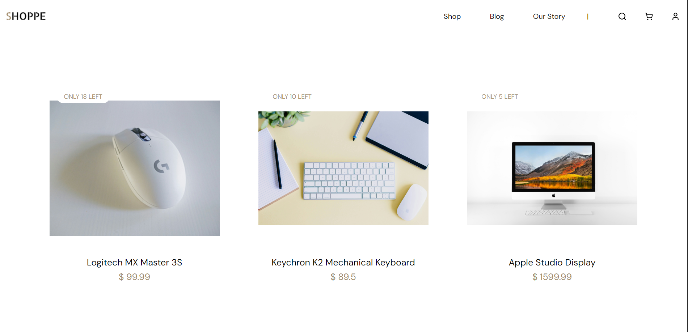
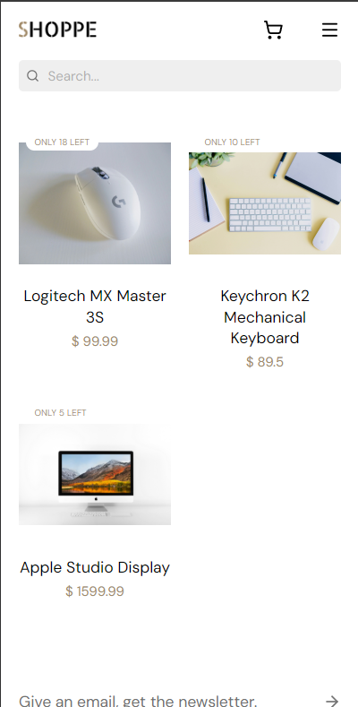

## Product Page
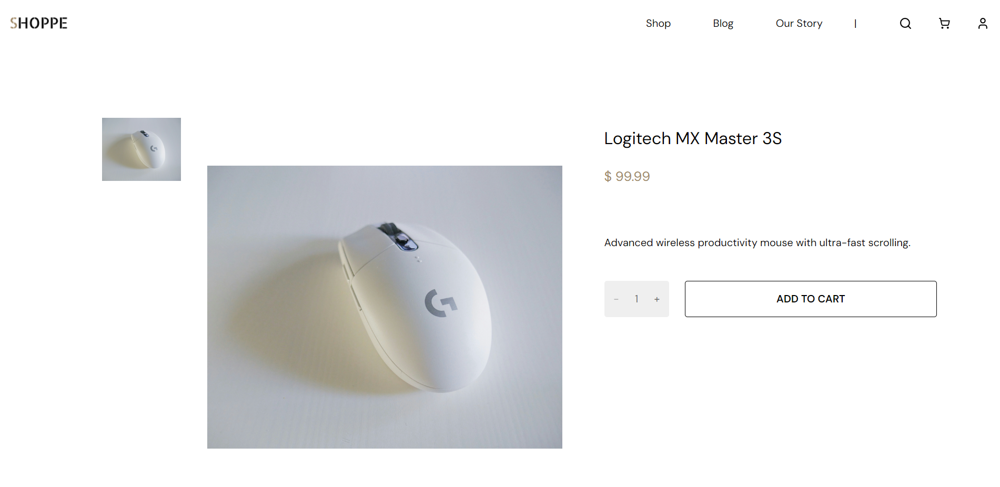
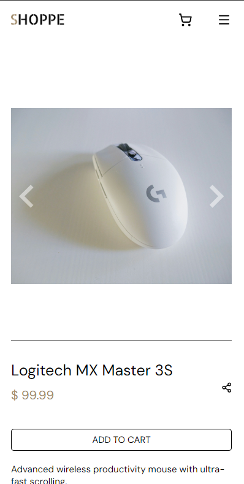

## Dashboard
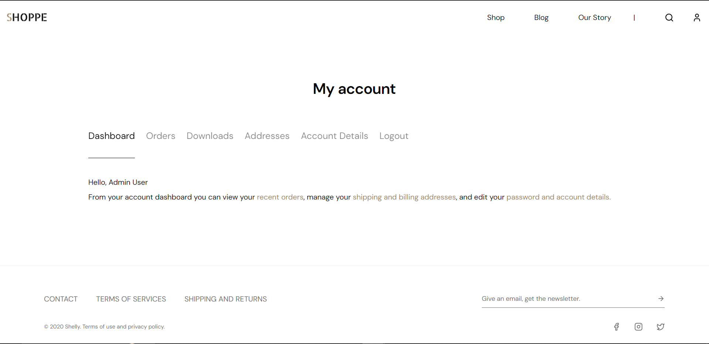
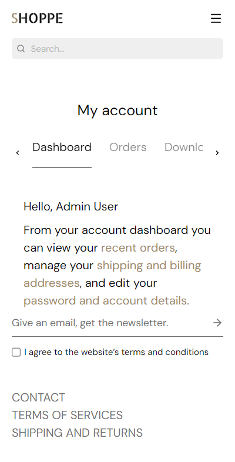

## Mobile UI
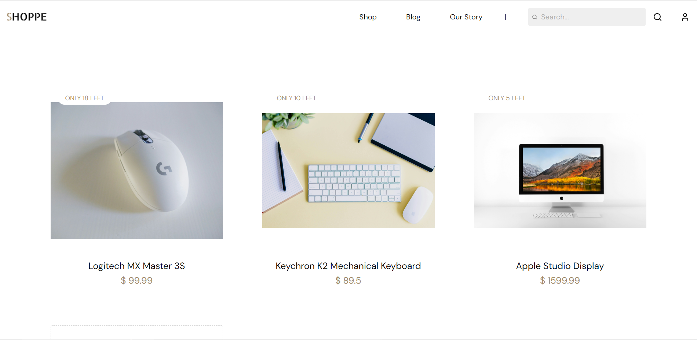
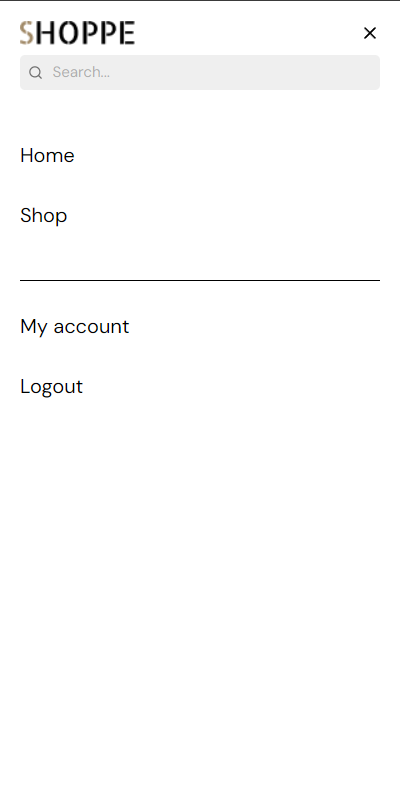

## Shop Page
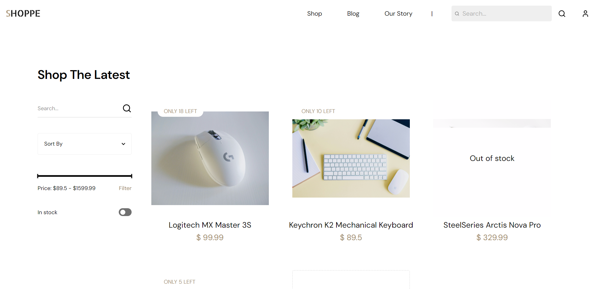
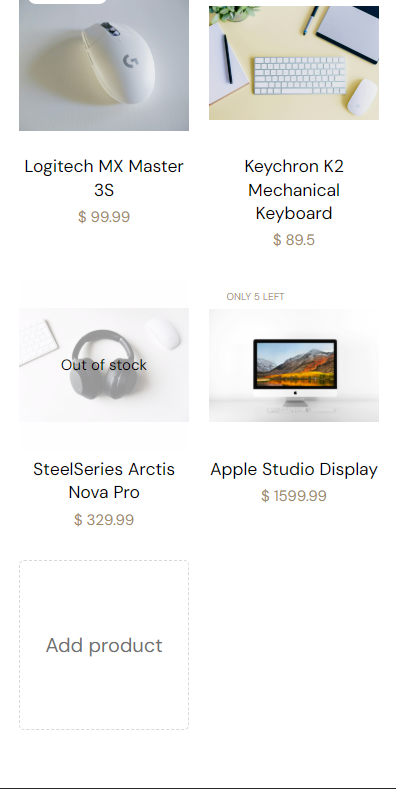

## Cart Page
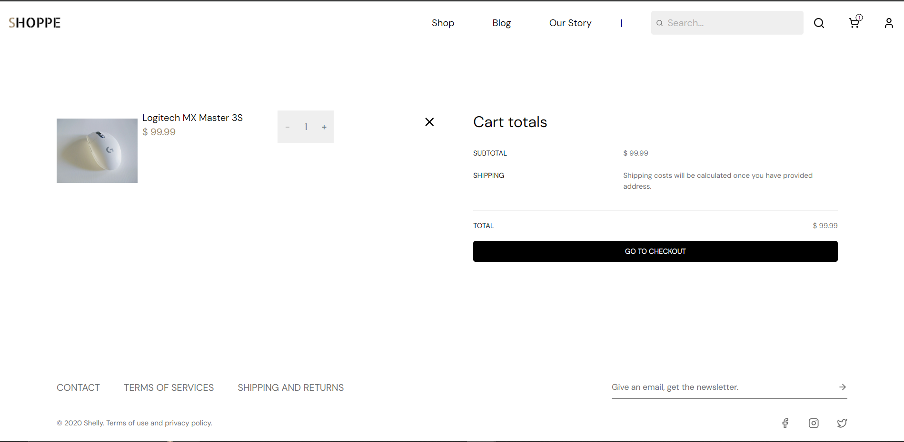
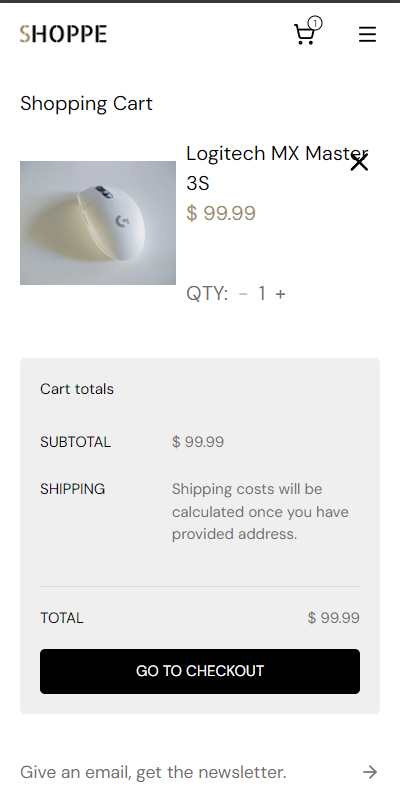

## Checkout Page
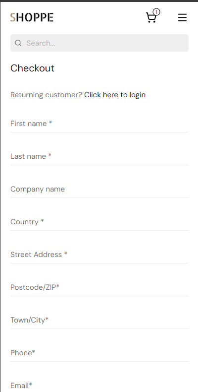
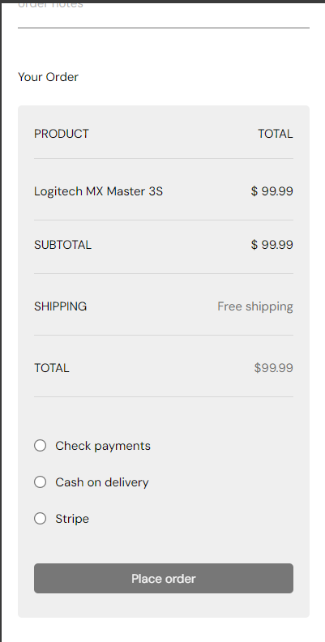

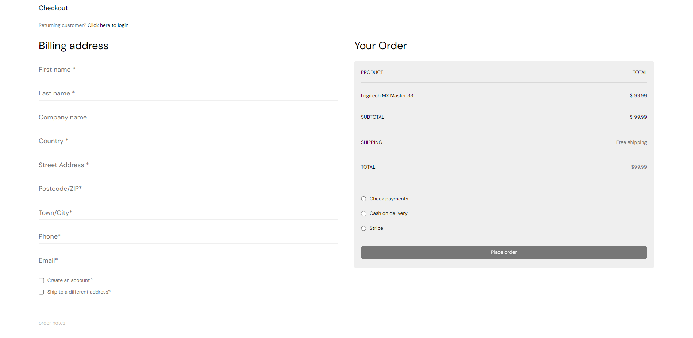

---

# HOW TO RUN LOCALLY

```bash
npm install
npm run dev
```

---

# ENVIRONMENT VARIABLES

Example `.env`:

```env
VITE_API_URL=
VITE_CLOUDINARY_CLOUD_NAME=
```

---

# FUTURE IMPROVEMENTS

## Reviews System
- Product reviews
- Product ratings
- Rating aggregation

## Payments
- Stripe integration
- Payment status handling

## Blog System
- Admin article management
- Public blog pages

## Email Notifications
- Order confirmations
- Delivery updates

---

# WHAT I LEARNED

This project helped me improve:
- scalable React architecture
- TypeScript strict mode
- responsive UI engineering
- cart synchronization patterns
- role-based UI handling
- async state management
- frontend deployment workflows
- image upload and management with Cloudinary